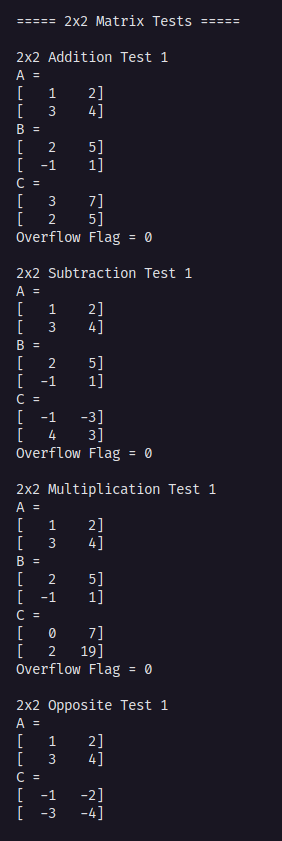
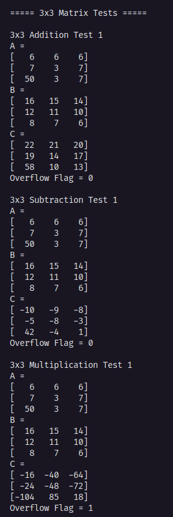
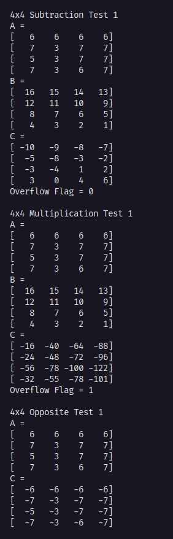
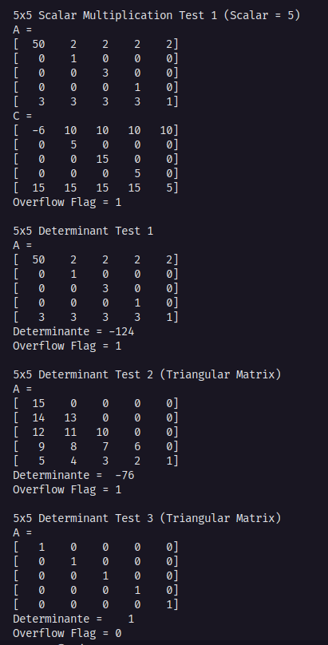

# 📝 Relatório Técnico - Coprocessador Aritmético em FPGA

## 📑 Sumário

- 🎯 [Objetivos e Requisitos do Problema](#objetivos-e-requisitos-do-problema)
- 🛠️ [Recursos Utilizados](#recursos-utilizados)
  - 🔧 [Quartus Prime](#quartus-prime)
  - 💻 [FPGA DE1-SoC](#fpga-de1-soc)
  - ⚡ [Icarus Verilog](#icarus-verilog)
- 🚀 [Desenvolvimento e Descrição em Alto Nível](#desenvolvimento-e-descrição-em-alto-nível)
  - 🎛️ [Unidade de Controle](#unidade-de-controle)
  - 🧮 [ULA (Unidade Lógica e Aritmética)](#unidade-lógica-aritmética)
- 🧪 [Testes, Simulações, Resultados e Discussões](#testes-simulações-resultados-e-discussões)

---

## 🌟 Introdução

Coprocessadores são componentes de hardware que atuam em conjunto com a CPU (Central Processing Unit), oferecendo suporte a tarefas específicas, geralmente com foco em otimização e desempenho. No contexto deste trabalho, foi desenvolvido um **coprocessador aritmético voltado para operações matriciais**, com o objetivo de acelerar cálculos complexos que seriam custosos se executados apenas pela CPU principal.

Esse projeto visa explorar os recursos da FPGA **DE1-SoC**, utilizando **descrição em Verilog** para projetar um sistema digital capaz de realizar operações fundamentais no processamento de matrizes. A escolha de implementar esse tipo de operação está relacionada à ampla aplicação em áreas como processamento de imagem, álgebra linear, simulações numéricas, aprendizado de máquina, entre outras.

## 🎯 Objetivos e Requisitos do Problema

O coprocessador foi planejado com foco em **desempenho**, utilizando **paralelismo em nível de hardware** para otimizar o tempo de execução das operações. Além disso, a compatibilidade com os dispositivos da DE1-SoC garante a viabilidade prática do projeto no ambiente de desenvolvimento utilizado.

### 📋 Requisitos do Projeto

1. Descrição completa do hardware utilizando a linguagem **Verilog**.
2. O sistema deve ser compatível e utilizar os componentes disponíveis na **FPGA DE1-SoC**.
3. Capacidade de realizar as seguintes operações matriciais:
   - Soma
   - Subtração
   - Multiplicação de matrizes
   - Multiplicação por número inteiro
   - Cálculo do determinante
   - Transposição
   - Geração da matriz oposta
4. Cada elemento da matriz é representado por um número de **8 bits (1 byte)**.
5. O processador deve implementar **paralelismo** para otimizar operações aritméticas.

- Quais os requisitos funcionais e não funcionais.
- Restrições ou limitações do projeto.

## 🛠️ Recursos Utilizados

### 🔧 Quartus Prime

- Síntese e Compilação:

O Quartus Prime é utilizado para compilar o projeto em Verilog, convertendo a descrição HDL em uma implementação física adequada para a FPGA. Durante esse processo, o compilador realiza a síntese lógica, o mapeamento e o ajuste de layout (place and route), otimizando as rotas lógicas e a alocação dos recursos internos da FPGA, conforme as recomendações descritas no User Guide: Compiler.

- Análise de Timing:

Emprega-se o TimeQuest Timing Analyzer para validar as restrições temporais, como os tempos de setup e hold, além de identificar os caminhos críticos no design. Essa análise é essencial para garantir que o projeto opere de forma estável em frequência alvo, conforme metodologias detalhadas na documentação oficial.

- Gravação na FPGA:

A programação da FPGA é realizada via Programmer, utilizando o cabo USB-Blaster. Esse procedimento suporta a gravação de múltiplos arquivos .sof, permitindo a configuração e reconfiguração do hardware conforme especificado nos guias técnicos da Intel.

- Design Constraints:

São definidas as restrições de pinos e de clock por meio do Pin Planner e das ferramentas de timing. Essas constraints garantem que as conexões físicas e os requisitos temporais sejam atendidos, alinhando-se às práticas recomendadas no User Guide da ferramenta.  

- Referência oficial: 
[**Quartus Prime Guide**](https://www.intel.com/content/www/us/en/support/programmable/support-resources/design-software/user-guides.html)

### 💻 FPGA DE1-SoC

- Especificações Técnicas:

A placa DE1-SoC, baseada no FPGA Cyclone V SoC (modelo 5CSEMA5F31C6N), conta com aproximadamente 85K elementos lógicos (LEs), 4.450 Kbits de memória embarcada e 6 blocos DSP de 18x18 bits. Essas características permitem a implementação de designs complexos e o processamento paralelo de dados.


-   Periféricos Utilizados:
    
    -   Switches e LEDs: 
        Utilizados para depuração e controle manual, permitindo, por exemplo, a seleção e visualização de operações matriciais.
        
    -   Acesso à Chip Memory:
        O design utiliza diretamente a memória embarcada na FPGA para armazenamento temporário de dados e matrizes, eliminando a necessidade de interfaces externas para memória DDR3.
        
    -   Compatibilidade:  
        O projeto foi compilado com Quartus Prime 20.1.1 e testado com a versão 6.0.0 do CD-ROM da DE1-SoC (rev.H), conforme as especificações técnicas fornecidas pela Terasic.

- Referência oficial:
[**Manual da Placa**](https://www.terasic.com.tw/cgi-bin/page/archive.pl?Language=English&No=836&PartNo=4)

### ⚡ Icarus Verilog

- Simulação RTL:

O Icarus Verilog é utilizado para simular a funcionalidade dos módulos de nível RTL, como a ULA (Unidade Lógica e Aritmética) e a Unidade de Controle. As simulações geram waveforms que podem ser visualizadas com o GTKWave, permitindo a análise detalhada do comportamento do design.  

- Validação de Casos de Borda:

Foram realizados testes exaustivos para validar situações extremas, como o overflow em operações de multiplicação de 8 bits, assegurando que o design opere corretamente sob todas as condições previstas.

- Referência oficial: 
 [**Icarus Verilog Compiler**](https://steveicarus.github.io/iverilog/)

## 🚀 Desenvolvimento e Descrição em Alto Nível

## 🎛️ Unidade de Controle

A **unidade de controle** é o componente responsável por processar as instruções, gerenciar o fluxo de dados e coordenar os outros componentes internos, funcionando como um organizador geral do sistema. Sua função é crucial para garantir a execução eficiente das operações, especialmente no contexto de processamentos matriciais.

A unidade de controle gerencia a comunicação entre a **memória RAM**, que armazena as matrizes a serem manipuladas, e os demais componentes, como a **ULA (Unidade Lógica e Aritmética)**, responsável pelo processamento aritmético das matrizes. Ela também desempenha um papel fundamental na **sincronização geral do sistema**, garantindo que todas as operações ocorram no tempo correto e de maneira ordenada.

Em termos de desempenho, a unidade de controle é o "cérebro" do sistema, sendo responsável por organizar e orquestrar as etapas de cada operação matricial. Ela garante que os dados sejam lidos da memória na ordem correta, que as operações sejam executadas corretamente pela ULA e que o fluxo de controle seja mantido sem erros durante o processamento das matrizes.

### 📜 Instruction Set Architecture

As instruções desenvolvidas para o coprocessador seguem um padrão uniforme para todos os tipos de operações realizadas, sejam elas de transferência de dados ou operações aritméticas. Essa decisão de projeto foi tomada com o objetivo de simplificar a complexidade associada à implementação das instruções, assegurando que a etapa de decodificação fosse generalizada e simplificada.
As instruções possuem um tamanho fixo de 8 bits e a estrutura das instruções é organizada da seguinte forma:

.jpg>)

Os campos da instrução são definidos por:
| Atributo | Descrição |
|----------|-----------|
| **MT** | Matriz alvo do carregamento (A ou B) |
| **M_Size** | Tamanho da matriz utilizado por operações de movimentação de dados e aritméticas |
| **OPCODE** | Código de operação |

📋 Conjunto de instruções do coprocessador:

### 🔢 Instruções aritméticas e seus Códigos Hexadecimais

| Instrução                            | Código Hexadecimal |
| ------------------------------------ | ------------------ |
| **Soma**                             | `0x01`             |
| **Subtração**                        | `0x02`             |
| **Multiplicação**                    | `0x03`             |
| **Multiplicação por número inteiro** | `0x04`             |
| **Transposição**                     | `0x05`             |
| **Matriz Oposta**                    | `0x06`             |
| **Determinante 2x2**                 | `0x17`             |
| **Determinante 3x3**                 | `0x1F`             |
| **Determinante 4x4**                 | `0x27`             |
| **Determinante 5x5**                 | `0x2F`             |

### 📥 Instruções de movimentação de dados e seus Códigos Hexadecimais

| Instrução                 | Código Hexadecimal |
| ------------------------- | ------------------ |
| **Carregar matriz A 2x2** | `0x10`             |
| **Carregar matriz A 3x3** | `0x18`             |
| **Carregar matriz A 4x4** | `0x20`             |
| **Carregar matriz A 5x5** | `0x28`             |
| **Carregar matriz B 2x2** | `0x50`             |
| **Carregar matriz B 3x3** | `0x58`             |
| **Carregar matriz B 4x4** | `0x60`             |
| **Carregar matriz B 5x5** | `0x68`             |

### 🔄 Etapas de processamento

As etapas de processamento do sistema são definidas por meio de uma máquina de estados finitos (FSM), responsável por receber e interpretar as instruções. Para o desenvolvimento dessa parte, foi necessário compreender como co-processadores realizam o recebimento e a execução de comandos. A partir desse estudo, foram definidos os seguintes estágios da FSM de processamento:

---

#### 🔍 Fetch

O estado Fetch representa a etapa inicial do fluxo de processamento. Sua principal função é realizar a busca da instrução na memória. No sistema implementado, essa busca ocorre no endereço 0x0, reservado exclusivamente para o armazenamento da instrução atual.  
A FSM aguarda um sinal de controle denominado "start process”, que indica a alocação de uma nova instrução no endereço especificado. Ao receber esse sinal, a FSM extrai os dados da posição de memória e os transfere para um registrador interno, o qual será utilizado na etapa seguinte do processamento.

---

#### 🧩 Decode

O estado Decode tem como função interpretar a instrução capturada durante a etapa de Fetch. Nessa fase, o sistema realiza a separação dos campos presentes na instrução e os aloca em registradores de controle apropriados. Esses registradores são essenciais para orientar o fluxo de dados e definir o comportamento da máquina nas etapas subsequentes do processamento.

---

#### ⚙️ Execute

O estado Execute é responsável por processar as informações contidas na instrução decodificada. Nessa etapa, o coprocessador realiza operações de leitura na memória ou delega à ULA (Unidade Lógica e Aritmética) a execução das operações aritméticas sobre as matrizes. Trata-se da fase central de todo o sistema, onde as instruções são efetivamente aplicadas, garantindo que os cálculos e movimentações de dados ocorram de forma correta e consistente.

---

#### 📝 WriteBack

O estado de writeback é responsável por escrever na memória a matriz resultante do processamento aritmético. Essa etapa assegura que os dados processados pela ULA estejam disponíveis para o processador no endereço de memória adequado.

---

#### 🧹 CleanUP

O estado CleanUP é responsável por reiniciar todos os registradores de controle da FSM, assegurando que o processamento não seja comprometido por resíduos de dados anteriores. A inclusão deste estágio mostrou-se vantajosa para evitar possíveis erros de metaestabilidade e garantir um ambiente limpo para a próxima operação. Após a conclusão desta etapa, o sistema retorna ao estado Fetch, aguardando uma nova sinalização de início de processamento.

### 🔄 Fluxos de Execução da FSM

O sistema possui dois fluxos de execução distintos que ocorrem na FSM, ambos projetados para realizar as operações de maneira otimizada, evitando desperdício de ciclos e assegurando um processamento eficiente.

---

#### 📥 Primeiro Fluxo: Leitura de Matrizes

O primeiro fluxo diz respeito à leitura das matrizes a partir da memória. Nesse processo de movimentação de dados, não há necessidade de realizar escrita, uma vez que ainda não foram processadas informações. Para evitar o uso desnecessário de ciclos e otimizar a execução, o processador segue o seguinte caminho:

**Fetch → Decode → Execute → CleanUp**

Essa abordagem garante agilidade ao evitar a passagem por estados que não são essenciais neste contexto específico.

---

#### 📤 Segundo Fluxo: Processamento Aritmético

O segundo fluxo está relacionado ao processamento aritmético das matrizes. Após a realização das operações, a matriz resultante deve ser armazenada novamente na memória. Para isso, o estado `WriteBack` é ativado, realizando a escrita dos dados no local apropriado. O fluxo de execução neste caso é:

**Fetch → Decode → Execute → WriteBack → CleanUp**

Essa decisão de projeto foi adotada com o intuito de evitar o trânsito desnecessário dos dados por estágios irrelevantes ao seu tipo de operação, otimizando o tempo de execução e assegurando maior eficiência no processamento.

### 🏦 Banco de Registradores

O banco de registradores é uma subdivisão essencial em qualquer co-processador, funcionando como uma área de armazenamento temporário para os dados manipulados durante a execução das instruções. No sistema desenvolvido, essa estrutura foi projetada com o objetivo de garantir agilidade no acesso às informações, reduzindo o tempo necessário para buscar dados diretamente na memória principal.

#### 🖼️ Diagrama Funcional

---


---

#### 📌 Tipos de Registradores

| Tipo                          | Função                                                                              |
| ----------------------------- | ----------------------------------------------------------------------------------- |
| **Registradores de Dados**    | Armazenam matrizes e operandos utilizados nas operações. Ligados à ULA e à memória. |
| **Registradores de Controle** | Guardam os campos extraídos das instruções, definindo o fluxo de execução.          |

A separação entre registradores de dados e de controle torna o sistema mais modular, facilitando o entendimento do fluxo de informações dentro do co-processador e otimizando sua implementação. Além disso, esse modelo contribui para a escalabilidade do projeto, permitindo futuras expansões ou adaptações com maior facilidade.

## Memória

A memória desempenha um papel crucial em co-processadores, pois é nela que as instruções e dados necessários para o processamento são acessados. No projeto desenvolvido, utilizamos a **OnChip Memory** da FPGA DE1-SoC. Essa memória funciona como uma memória RAM simples e possui parâmetros configuráveis, permitindo um controle mais eficiente durante o processamento.

Neste projeto, a memória foi projetada de forma enxuta, com o único objetivo de permitir o armazenamento e recebimento de instruções e os resultados após a finalização dos processos aritméticos.

#### Parâmetros de entrada e saída da memória:

- **clk**: Sinal de clock utilizado para sincronizar a memória com o restante do sistema.
- **wren**: Sinal de controle que permite a escrita na memória.
- **Mem_data**: Canal de 16 bits utilizado para a escrita de dados na memória (barramento de 16 bits).
- **q**: Canal de saída de dados da memória, também com barramento de 16 bits, responsável por retornar os dados armazenados.
- **address**: Entrada de dados que especifica o endereço de memória a ser acessado, permitindo a leitura ou escrita no local desejado.

#### Diagrama da memória
---

---

## Leitura de Dados da Memória

A leitura dos dados da memória é realizada diretamente na unidade de controle. A lógica foi projetada para lidar com as matrizes de tamanho fixo 5x5, como mencionado anteriormente, e garantir a eficiência ao acessar os dados sequenciais da memória.

#### Código de Leitura:

```verilog
// ======= LOAD MATRIZ ==========
3'b000: begin
    if (!loadingMatrix) begin
        loadingMatrix <= 1;
        load_counter <= 0;
        read_pending <= 1;
        if begin (Flag_A == 0) matrix1 <= 200'b0; end
        else begin matrix2 <= 200'b0; end
    end else if (read_pending) begin
        read_pending <= 0; // Espera 1 ciclo para Mem_data
    end else begin
        if (load_counter < (matrix_size * matrix_size)) begin
            row1 = load_counter / matrix_size;
            col1 = load_counter % matrix_size;
            virt_idx1 = row1 * 5 + col1;
            if (Flag_A == 0) begin
                matrix1[virt_idx1*8 +: 8] <= Mem_data[15:8];
            end else begin
                matrix2[virt_idx1*8 +: 8] <= Mem_data[15:8];
            end
        end
        if ((load_counter + 1) < (matrix_size * matrix_size)) begin
            row2 = (load_counter + 1) / matrix_size;
            col2 = (load_counter + 1) % matrix_size;
            virt_idx2 = row2 * 5 + col2;
            if (Flag_A == 0) begin
                matrix1[virt_idx2*8 +: 8] <= Mem_data[7:0];
            end else begin
                matrix2[virt_idx2*8 +: 8] <= Mem_data[7:0];
            end
        end
        load_counter <= load_counter + 2;
        if ((load_counter + 2) >= (matrix_size * matrix_size)) begin
            load_done <= 1;
        end else begin
            address <= address + 1;
            read_pending <= 1;
        end
    end
end
```

### Processo de Leitura:

1. **Início do processo de leitura:**
   - Quando `loadingMatrix` é zero, isso significa que ainda não começamos a carregar a matriz. Portanto e o contador de carregamento (`load_counter`) é zerado.
   - O sinal `read_pending` é ativado para aguardar a leitura dos dados.
   - Se a matriz que estamos carregando for a matriz A (`Flag_A == 0`), o vetor `matrix1` é zerado; caso contrário, a matriz B (`matrix2`) é zerada.

2. **Carregamento dos dados:**
   - O código verifica se a matriz ainda não foi completamente carregada. Se não foi, ele usa o contador de carregamento para calcular a linha e a coluna do elemento a ser lido e mapeado na posição correta da memória.
   - A matriz é preenchida utilizando índices virtuais, `virt_idx1` e `virt_idx2`, que são calculados com base no contador `load_counter`. Esses índices indicam a posição na matriz de 5x5. Isso é feito para armazenar e trabalhar com matrizes menores no formato 5x5 de forma correta.
   - O código também cuida de separar os dados de 16 bits, onde 8 bits são lidos de cada vez. Se for a matriz A (`Flag_A == 0`), os dados são colocados em `matrix1`; caso contrário, em `matrix2`.

3. **Controle de ciclos:**
   - A cada ciclo, o contador de leitura (`load_counter`) é incrementado em 2, já que estamos lendo dois números (16 bits) por vez. O endereço de memória é atualizado para acessar a próxima posição, e a variável `read_pending` é ativada novamente.

4. **Finalizando o carregamento:**
   - Quando todos os dados da matriz foram lidos, o sinal `load_done` é ativado, indicando que o carregamento da matriz foi concluído.

## Escrita de Dados na Memória

A escrita dos dados segue uma lógica semelhante à da leitura, mas com o objetivo de gravar os resultados após o processamento das matrizes. Dessa forma, a escrita das matrizes resultantes são feitas da seguinte forma:


### Código de Escrita:

```verilog
LED <= 1'b1;
WB <= 1'b1;

// Sempre lê do buffer 5x5 (25 elementos)
write_data[15:8] <= result[store_counter*8 +: 8];  // Elemento atual
write_data[7:0] <= result[(store_counter+1)*8 +: 8]; // Próximo elemento

// Endereço base + offset (cada par ocupa 1 word)
address <= 8'd14 + (store_counter >> 1);

// Controle de ciclos de escrita
if (write_counter < 3) begin
    write_counter <= write_counter + 1;
end else begin
    write_counter <= 0;
    store_counter <= store_counter + 2;

    // Finaliza após escrever TODOS os 25 elementos (5x5)
    if (store_counter >= 24) begin  // 25º elemento está no índice 24
        WB <= 0;
        store_counter <= 0;
        write_done <= 1'b1;
    end
end
```

### Processo de Escrita:

1. **Controle de Escrita:**
   - A escrita dos dados é iniciada ao ativar o sinal de controle  `WB`.
   - O vetor `write_data` é preenchido com os dados do resultado, onde o valor de `result` é dividido em duas partes. A primeira parte (8 bits) vai para `write_data[15:8]`, e a segunda parte vai para `write_data[7:0]`.

2. **Cálculo do Endereço de Memória:**
   - O endereço de memória é calculado com base no endereço base, somando o offset de cada par de elementos (dois elementos por palavra na memória).

3. **Controle de Ciclos de Escrita:**
   - Um contador (`write_counter`) é usado para controlar o número de ciclos de escrita. A cada ciclo, ele é incrementado até atingir o limite de 3, e então o contador é resetado.
   - O contador `store_counter` é utilizado para indicar o elemento atual a ser armazenado.

4. **Finalizando a Escrita:**
   - Quando todos os 25 elementos da matriz 5x5 (representados por `store_counter` até o valor 24) forem gravados na memória, o sinal `WB` é desativado, indicando que a escrita foi concluída, e o sinal `write_done` é ativado, finalizando o processo.

A implementação das operações de leitura e escrita foram projetadas para otimizar a interação com a memória, garantindo uma sincronização eficiente com o processo de manipulação das matrizes. As decisões de projeto adotadas, como o controle de ciclos e o uso de buffers de 5x5, permitem que os dados sejam acessados e armazenados de forma eficaz, minimizando desperdício de ciclos e garantindo a integridade dos resultados ao final do processamento.

## 🧮 Unidade Lógica-Aritmética

### 💡 O que é uma ULA?

A Unidade Lógica-Aritmética (ULA) é o componente responsável por realizar operações matemáticas em processadores ou co-processadores especializados em cálculos específicos.

No contexto deste projeto, a ULA foi desenvolvida como parte da primeira avaliação da disciplina MI - Sistemas Digitais, sendo integrada a um co-processador especializado em operações matriciais.

Uma Unidade Lógica-Aritmética se trata do componente responsável por realziar as operações nos processadores ou co-processadores especialziados em cálculos específicos. No contexto do problema, a ULA desenvolvida para o co-processador, requisitado como primeira avaliação da disciplina MI - Sistemas Digitais, é especializado em operações matriciais.

### 🏗️ Arquitetura

#### Módulo Principal (`alu.v`)

- Controla todas as operações
- Seleciona sub-módulos baseado no opcode
- Gerencia sinais de clock, done e overflow

#### Sub-módulos Especializados

| Módulo                      | Operação | Descrição                     |
| --------------------------- | -------- | ----------------------------- |
| `alu_sum_module`            | A + B    | Soma elemento a elemento      |
| `alu_subtraction_module`    | A - B    | Subtração elemento a elemento |
| `alu_multiplication_module` | A × B    | Multiplicação matricial       |
| `alu_opposite_module`       | -A       | Matriz oposta                 |
| `alu_transpose_module`      | Aᵀ       | Matriz transposta             |
| `alu_scalar_module`         | k·A      | Multiplicação por escalar     |
| `alu_determinant_module`    | det(A)   | Cálculo de determinante       |

### 📊 Operações Suportadas

```verilog
case (opcode)
  3'b001: begin  // Soma
      C_flat = sum_C;
      overflow_flag = sum_ovf;
  end
  3'b010: begin  // Subtração
      C_flat = sub_C;
      overflow_flag = sub_ovf;
  end
  3'b011: begin  // Multiplicação
      C_flat <= mul_C;
      overflow_flag <= mul_ovf;
  end
  3'b100: begin  // Matriz oposta
      C_flat = opposite_C;
  end
  3'b101: begin  // Transposta
      C_flat = transpose_C;
  end
  3'b110: begin  // Produto por escalar
      C_flat = scalar_C;
      overflow_flag = scalar_ovf;
  end
  3'b111: begin  // Determinante
      number = determinant_number;
      overflow_flag = determinant_ovf;
      done = determinant_done;
  end
  default: begin // Caso inválido
      C_flat = 200'b0;
      overflow_flag = 1'b0;
      done = 1'b1;
  end
endcase
```

## 🔍 Detecção de Overflow

- Soma/Subtração: Verifica mudança inesperada no bit de sinal

- Multiplicação: Checa se bits superiores diferem do bit de sinal

- Determinante: Verifica se resultado excede 8 bits

## ⚙️ Como Executar

1. Executar makefile:

```bash
make run
```

#### 🔁 Operações com Lógica Combinacional

As operações de soma, subtração, transposição, matriz oposta e produto por escalar são realizadas em apenas um ciclo de clock, utilizando lógica combinacional.

#### ⚙️ Multiplicação com Shift and Add

Para a operação de multiplicação, a técnica Shift and Add foi adotada com o objetivo de reduzir o consumo de DSP Blocks — blocos especializados em multiplicação que são recursos escassos na FPGA [DE1-SoC](https://www.terasic.com.tw/cgi-bin/page/archive.pl?Language=English&No=836). Essa técnica consiste em realizar deslocamentos de bits seguidos de somas, ao invés da multiplicação convencional.

#### 📐 Determinante com Cálculo Sequencial

O cálculo de determinantes para matrizes quadradas de ordem N ≥ 3 é uma operação computacionalmente complexa. Portanto, foi implementado de forma sequencial, tornando o processo mais viável em termos de desempenho e uso de recursos.

#### 📥 Como a ULA recebe os dados e sinais de controle

Após a UC [(Unidade de Controle)](#unidade-de-controle) obter as matrizes e o opcode da operação, ela realiza a tratativa e o empacotamento dos dados. Em seguida, envia para a ULA 25 bytes, cada um representando um elemento da matriz máxima suportada: uma matriz quadrada 5x5.

Essa padronização permite que a ULA opere diretamente sobre o conjunto de dados sem a necessidade de redefinir estruturas internas para diferentes dimensões de matriz.

#### 📤 Como os resultados são manipulados e retornados

A ULA opera sempre com matrizes de ordem 5x5, mesmo quando a matriz de entrada possui uma ordem inferior (como 2x2 ou 4x4). Para operações como soma, subtração, transposição, matriz oposta, produto por escalar e multiplicação de matrizes, o tamanho real da matriz não influencia no resultado, pois os elementos fora da região válida são preenchidos com zero.

Essa estratégia permite que todas as operações sejam realizadas por um único módulo, otimizando a lógica e facilitando o suporte a diferentes dimensões de matrizes de forma unificada.

Os valores são preenchidos corretamente nos espaços correspondentes da "fita de bytes", que posteriormente é retornada à UC (Unidade de Controle) para processamento ou exibição.

#### ⚠️ Atenção ao cálculo do determinante:

Para a operação de determinante, o tamanho da matriz impacta diretamente o resultado. Por isso, é utilizado o [Teorema de Laplace](https://pt.wikipedia.org/wiki/Teorema_de_Laplace), e há um módulo dedicado para cada tamanho de matriz, garantindo precisão no cálculo para matrizes de diferentes ordens.

## 🧪 Testes e Simulações

A metodologia de Testes usada para garantir o correto funcionamento da ULA foram conduzidos em duas etapas:

Simulação via Icarus Verilog, inicialmente, todos os módulos foram testados de forma isolada utilizando o simulador Icarus Verilog. Após a validação por simulação, o projeto foi sintetizado no ambiente Quartus Prime II e implementado na placa DE1-SoC, replicando o ambiente final de operação do co-processador.

## 🧷 Testes Individuais por Operação

Cada operação foi testada com diferentes matrizes de entrada, garantindo cobertura para matrizes de ordem 2x2 até 5x5.

<div align="center" style="display: flex; flex-wrap: wrap; justify-content: center; gap: 10px;">

  <div style="flex: 1 1 45%; text-align: center;">
    
    <p><em>🔍 Simulação - Teste de matrizes 2x2</em></p>
  </div>

  <div style="flex: 1 1 45%; text-align: center;">
    
    <p><em>⚙️ Simulação - Teste de matrizes 3x3</em></p>
  </div>

  <div style="flex: 1 1 45%; text-align: center;">
    
    <p><em>📈 Simulação - Teste de matrizes 4x4</em></p>
  </div>

  <div style="flex: 1 1 45%; text-align: center;">
    
    <p><em>📉 Simulação - Teste de matrizes x5</em></p>
  </div>

</div>

## 📈 Análise dos Resultados

Os testes revelaram que:

- ✅ As operações de lógica combinacional foram executadas corretamente em um único ciclo de clock, apresentando excelente desempenho.

- ✅ A operação de multiplicação por Shift and Add mostrou-se eficiente no uso de recursos, consumindo significativamente menos DSPs que a multiplicação direta.

- ⚠️ O cálculo do determinante, por ser realizado de forma sequencial, demandou mais ciclos de clock. No entanto, a divisão por módulos específicos para cada ordem de matriz tornou o tempo aceitável para o contexto do projeto.

- ✅ O preenchimento das regiões inválidas da matriz com zero funcionou corretamente, mantendo a integridade dos dados para ordens menores.

## 📉 Desempenho e Uso de Recursos

Durante a síntese no Quartus Prime II, foram observadas as seguintes métricas relevantes:

<div align="center" style="display: flex; flex-wrap: wrap; justify-content: center; gap: 10px;">
  <div style="flex: 1 1 45%; text-align: center;">
    
    <p><em>🔍 Recursos utilizados no Quartus Prime II</em></p>
  </div>
</div>

- Baixo consumo de **DSP Blocks**, uma vez que foi visado o baixo uso do recurso, por ser escasso, assim deixar para utilização de outros componentes de controle e etc.

- Utilização moderada de **ALMs**, uma vez que é um recurso abundante. Dessa forma, optamos por utiliza-lô de maneira modearada.

## 💭 Discussões e Melhorias Futuras

Embora a ULA tenha se comportado conforme o esperado, algumas melhorias podem ser consideradas:

- 🧮 Cálculo otimizado de determinante: explorar técnicas como eliminação de Gauss para reduzir a complexidade sequencial.

- 🧩 Suporte a matrizes não quadradas: possibilidade futura de expansão do módulo para aceitar operações com matrizes de diferentes dimensões.

## ✍️ Colaboradores

Este projeto foi desenvolvido por:

- [**Guilherme Fernandes Sardinha**](https://github.com/DrizinCoder) – Desenvolvimento da Unidade de controle, simulações, testes e escrita do relatório.
- [**Robson Carvalho de Souza**](https://github.com/Robson-Carvalho) – Desenvolvimento da ULA (Unidade Lógica-Aritmética), simulações, testes e escrita do relatório.
- [**Lucas Damasceno da Conceição**](https://github.com/Lucas-Damasceno-dev/calculoDeterminante/blob/main/determinant5x5_expansion.v) – Suporte na ULA e escrita do relatório.

Agradecimentos ao(a) professor(a) [**Wild Freitas da Silva Santos**] pela orientação.

---
